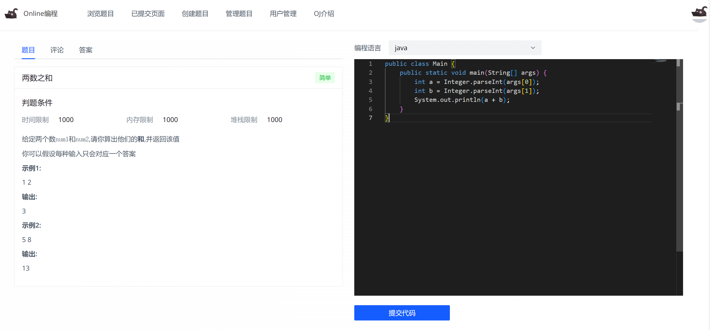
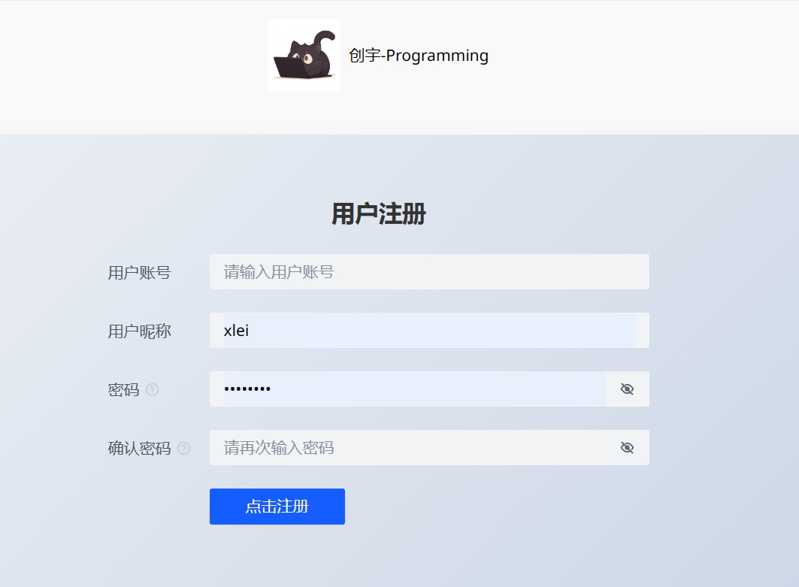
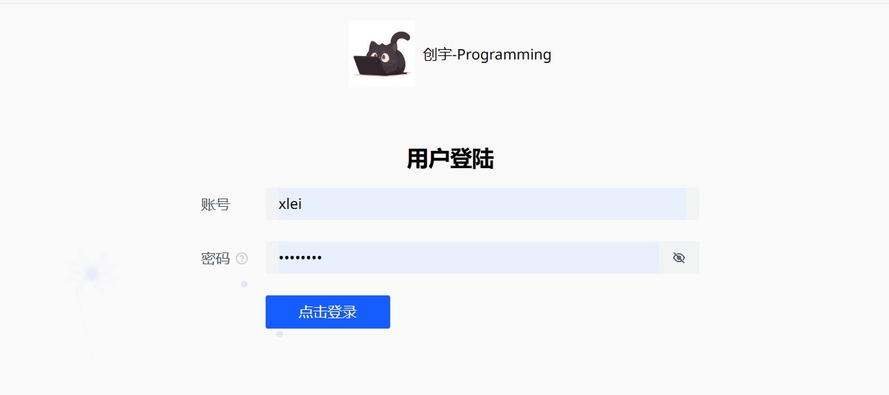
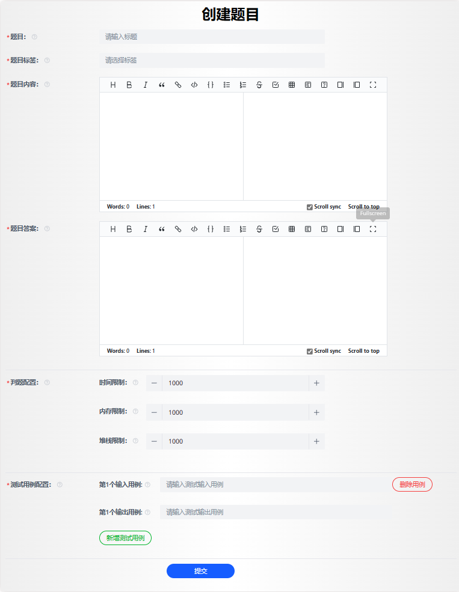
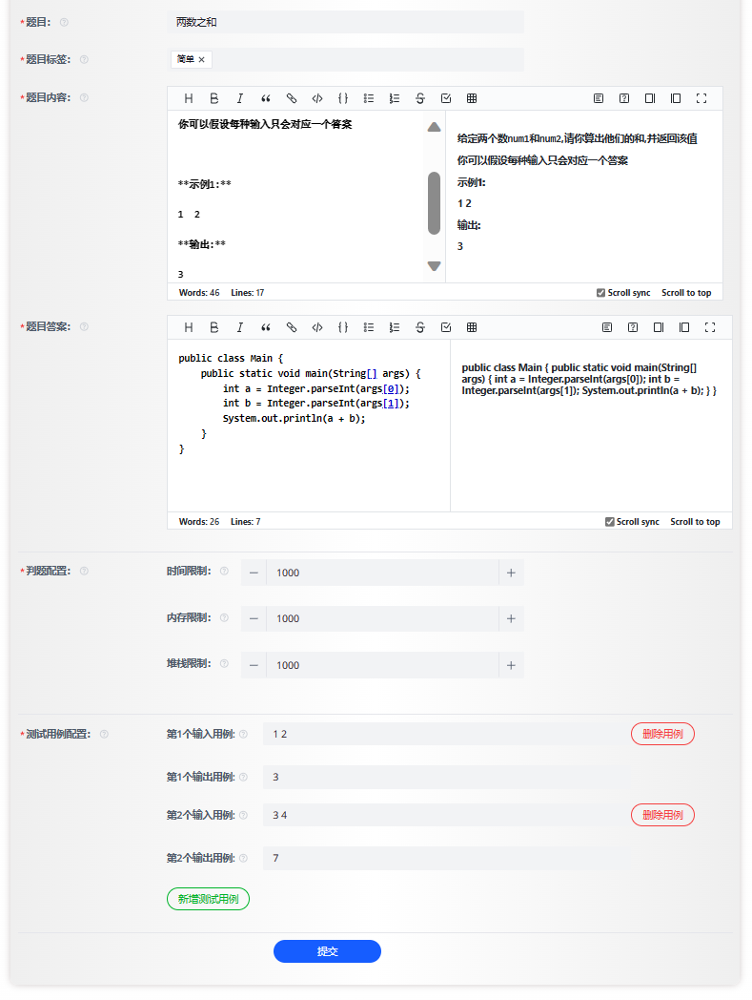
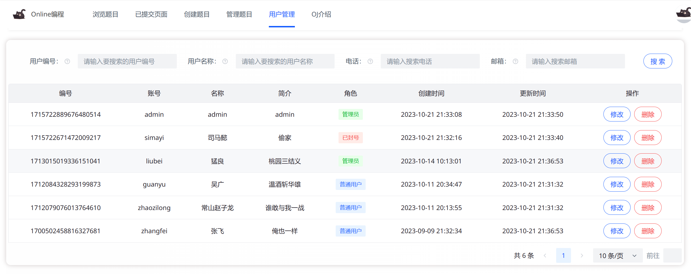

# 在线做题系统项目文档

---

<p align="center">
<a>
    
    
    
    
    
    
    
    
    
    
</a>
</p>

> **作者：[猛良](https://github.com/wuguang434)**

# 在线判题系统

该项目是基于微服务的算法题在线评测系统，分为网关、用户、在线判题和代码沙箱4个微服务，其中用户和网关微服务复用了之前的开发社区项目。在系统前台，管理员可以创建、管理题目，用户可以搜索、查看题目，编写代码并进行在线自测和提交。在系统后端，自主实现了代码沙箱，能够根据接收的测试用例对代码进行编译、运行并给出输出结果。代码沙箱作为独立服务，可以提供给其他开发者使用。


github仓库：

- 后端：https://github.com/wuguang434/cyoj3-backend
- 前端：https://github.com/wuguang434/cyoj3-frontend.git


## 前端页面

### 首页


### 题目详情页



----
## 后端技术点

----

### 本地代码沙箱

#### 字典树校验违禁词

代码有违禁词，例如Files，exec等，防止用户写入木马文件并执行。使用字典树可以**减少存储空间，而且提高检索效率**

```
字典树（Trie树，也称为前缀树）是一种树形数据结构，用于有效地存储和检索一组字符串，通常是字符串集合或关键字集合。字典树的主要特点是将共享相同前缀的字符串存储在同一层次结构中，从而实现了高效的字符串查找和前缀匹配。

字典树的关键特点包括：
①根节点： 字典树通常有一个根节点，表示空字符串或空前缀。
②节点结构： 每个节点包含多个子节点，每个子节点代表一个字符。通常，字典树中的每个节点都有固定数量的子节点，通常是字符集的大小（例如，26个字母）。
③路径： 从根节点到任何一个节点，沿着路径的字符连接在一起，构成一个字符串。这个路径上的字符序列即表示存储在字典树中的字符串。
④叶节点： 叶节点是表示一个完整字符串的节点，不再有子节点。当我们从根节点到叶节点沿着路径移动时，就可以得到存储在字典树中的一个字符串。
⑤前缀匹配： 字典树非常适合前缀匹配操作。要查找以某个字符串为前缀的所有字符串，只需从根节点开始，沿着路径移动到表示该前缀的节点，然后遍历该节点的所有子节点，即可获取所有匹配的字符串。
⑥高效性能： 字典树在存储和检索字符串集合方面具有高效性能，特别适合于自动完成、单词搜索、拼写检查等应用。

尽管字典树在存储和前缀匹配方面非常高效，但它也有一些缺点。其中主要的问题是空间开销，因为字典树需要存储大量的节点，特别是对于大型字符串集合。为了解决这个问题，可以使用压缩的字典树变体，如压缩字典树（Compressed Trie）或基数树（Radix Tree），以减少存储空间的开销。

总之，字典树是一种用于高效存储和检索字符串集合的数据结构，特别适用于需要进行前缀匹配的应用。它在搜索引擎、自动完成、拼写检查和路由表等领域都有广泛的应用
```

一个字典树的实现

```Java
class TrieNode {
    private TrieNode[] children;
    private boolean isEndOfWord;

    public TrieNode() {
        children = new TrieNode[26]; // 假设只包含小写字母
        isEndOfWord = false;
    }

    public void insert(String word) {
        TrieNode current = this;
        for (char c : word.toCharArray()) {
            int index = c - 'a';
            if (current.children[index] == null) {
                current.children[index] = new TrieNode();
            }
            current = current.children[index];
        }
        current.isEndOfWord = true;
    }

    public boolean search(String word) {
        TrieNode node = searchPrefix(word);
        return node != null && node.isEndOfWord;
    }

    public boolean startsWith(String prefix) {
        return searchPrefix(prefix) != null;
    }

    private TrieNode searchPrefix(String prefix) {
        TrieNode current = this;
        for (char c : prefix.toCharArray()) {
            int index = c - 'a';
            if (current.children[index] == null) {
                return null; // 找不到前缀
            }
            current = current.children[index];
        }
        return current;
    }
}

public class Trie {
    private TrieNode root;

    public Trie() {
        root = new TrieNode();
    }

    public void insert(String word) {
        root.insert(word);
    }

    public boolean search(String word) {
        return root.search(word);
    }

    public boolean startsWith(String prefix) {
        return root.startsWith(prefix);
    }

    public static void main(String[] args) {
        Trie trie = new Trie();
        trie.insert("apple");
        System.out.println(trie.search("apple"));   // 输出 true
        System.out.println(trie.search("app"));     // 输出 false
        System.out.println(trie.startsWith("app")); // 输出 true
        trie.insert("app");
        System.out.println(trie.search("app"));     // 输出 true
    }
}
```

---

#### SecurityManager

`SecurityManager` 是 Java 中的一个安全管理器类，用于实施安全策略，限制程序的各种操作，以确保Java程序在受限的环境中运行。它是Java平台中的一项安全特性，用于控制应用程序的权限和行为，以保护系统免受恶意代码或不当行为的影响。`SecurityManager` 主要用于Java应用程序的安全性和沙箱隔离。

以下是一些`SecurityManager`的常见应用场景和用途：

1. **限制文件访问：** `SecurityManager`可以限制Java应用程序对文件系统的访问，以确保只有授权的文件可以被读取或写入。
2. **网络权限控制：** 它可以控制Java应用程序的网络操作，例如限制应用程序的网络连接，确保不会进行不安全的网络操作。
3. **限制系统属性访问：** `SecurityManager`可以防止Java应用程序访问敏感的系统属性，以保护系统信息的安全性。
4. **自定义权限检查：** 开发人员可以自定义`SecurityManager`的权限检查逻辑，根据应用程序的需要进行扩展。
5. **沙箱隔离：** 通过使用`SecurityManager`，可以将Java应用程序限制在受控的沙箱环境中，以减少潜在的安全风险。

下面是一个简单的示例，演示如何在Java应用程序中使用`SecurityManager`来限制文件访问权限：

```
javaCopy codeimport java.io.File;
import java.security.Permission;

public class FileSecurityManager extends SecurityManager {
    @Override
    public void checkRead(String file) {
        if (file.endsWith(".txt")) {
            throw new SecurityException("Access to .txt files is not allowed.");
        }
    }

    public static void main(String[] args) {
        // 安装自定义的SecurityManager
        System.setSecurityManager(new FileSecurityManager());

        // 尝试访问文件
        try {
            File file = new File("sample.txt");
            System.out.println("File can be read: " + file.canRead());
        } catch (SecurityException e) {
            System.out.println("Security Exception: " + e.getMessage());
        }
    }
}
```

在上述示例中，自定义的`FileSecurityManager`扩展了`SecurityManager`，并覆盖了`checkRead(String file)`方法，以检查对文件的读取操作。如果文件名以`.txt`结尾，将抛出`SecurityException`，从而禁止对`.txt`文件的访问。

在`main`方法中，我们安装了自定义的`FileSecurityManager`作为安全管理器，然后尝试访问一个文件。如果文件名以`.txt`结尾，将抛出`SecurityException`，否则可以正常访问。这个示例演示了如何使用`SecurityManager`来限制文件访问权限，以确保只有授权的文件可以被访问。

```java
public class MySecurityManager extends SecurityManager {
    // 检测程序是否可执行文件
    @Override
    public void checkExec(String cmd) {
        throw new SecurityException("checkExec 权限异常：" + cmd);
    }

    // 检测程序是否允许写文件
    @Override
    public void checkWrite(String file) {
        throw new SecurityException("checkWrite 权限异常：" + file);
    }

    // 检测程序是否允许删除文件
    @Override
    public void checkDelete(String file) {
        throw new SecurityException("checkDelete 权限异常：" + file);
    }

    // 检测程序是否允许连接网络
    @Override
    public void checkConnect(String host, int port) {
        throw new SecurityException("checkConnect 权限异常：" + host + ":" + port);
    }
}
```

项目中简单粗暴地关闭了本地代码沙箱的执行、写、删除文件的权限以及连接网络的权限

---

#### Runtime

```
Runtime 类是 Java 中的一个系统类，用于与运行时环境进行交互和管理。它的主要作用是提供了一种在 Java 程序中执行系统级操作的方式，例如：
执行外部进程： 使用 Runtime 类，您可以在 Java 程序中启动和执行外部系统进程。这对于调用其他可执行程序或系统命令非常有用。
获取系统信息： Runtime 类允许您获取关于运行时环境的信息，如可用处理器数量、可用内存、操作系统信息等。
垃圾回收操作： 您可以使用 Runtime 类的 gc() 方法强制运行垃圾回收器来尝试释放不再使用的内存。
关闭虚拟机： Runtime 类的 exit() 方法允许您终止 Java 虚拟机的运行。这可以用于正常退出程序或在出现严重错误时终止程序。

请注意，从 Java 9 开始，一些 Runtime 的方法已经被标记为废弃，而且在某些情况下，更推荐使用 ProcessBuilder 类来执行外部进程。

总之，Runtime 类提供了一些与运行时环境交互的基本功能，使您能够执行一些系统级操作，但在使用时需要谨慎，以免造成不必要的系统干扰。
```

Runtime如何执行外部进程

`Runtime` 类可以用于执行外部进程。它提供了一个名为 `exec(String command)` 的方法，该方法用于执行指定的命令或可执行文件。下面是一个简单的示例，展示如何使用 `Runtime` 执行外部进程：

```
javaCopy codepublic class ExecuteExternalProcess {
    public static void main(String[] args) {
        try {
            // 使用Runtime.getRuntime()获取Runtime对象
            Runtime runtime = Runtime.getRuntime();
            
            // 要执行的外部命令或可执行文件
            String command = "ls -l"; // 在Unix/Linux系统上列出当前目录的文件列表
            
            // 使用exec()方法执行外部进程
            Process process = runtime.exec(command);
            
            // 处理进程的输出流
            InputStream inputStream = process.getInputStream();
            BufferedReader reader = new BufferedReader(new InputStreamReader(inputStream));
            String line;
            
            // 读取并输出进程的输出
            while ((line = reader.readLine()) != null) {
                System.out.println(line);
            }
            
            // 等待进程执行完成
            int exitCode = process.waitFor();
            System.out.println("进程执行完毕，退出代码：" + exitCode);
        } catch (IOException | InterruptedException e) {
            e.printStackTrace();
        }
    }
}
```

在上述示例中，我们使用 `Runtime.getRuntime().exec(command)` 执行了一个外部命令，并获取了该进程的输出流，以便读取其输出。然后，我们使用 `process.waitFor()` 等待进程执行完成，并获取其退出代码。

请注意，这只是一个基本示例，实际应用中可能需要更多的错误处理和参数设置，具体取决于要执行的外部进程和您的需求。

---

### Docker代码沙箱

使用Docker实现的代码沙箱和通过Java的`Runtime`实现的代码沙箱各有其优缺点，具体取决于您的需求和用例：

**Docker 实现的代码沙箱：**

优点：

1. **强大的隔离性：** Docker容器提供了强大的隔离性，可以将用户代码隔离到独立的容器中，防止其访问主机系统资源。
2. **资源限制：** Docker允许您精确地限制容器的资源使用，包括CPU、内存和磁盘空间。
3. **容易部署和管理：** Docker容器可以轻松部署和管理，可以快速启动和停止，也支持自动化部署和扩展。
4. **安全性：** 使用容器化技术，容易实现安全配置，可以控制容器的访问权限和网络连接，增强了安全性。

缺点：

1. **资源开销：** Docker容器相对较重，需要一定的系统资源和存储空间。
2. **启动时间：** 相比于`Runtime`方式，启动一个Docker容器需要更多时间。
3. **复杂性：** Docker容器的设置和管理相对较复杂，需要一定的学习曲线。

**通过Java的 `Runtime` 实现的代码沙箱：**

优点：

1. **轻量级：** 与Docker容器相比，使用`Runtime`执行外部进程的方式更加轻量级，不需要额外的容器化资源。
2. **启动快速：** 启动外部进程通常比启动Docker容器更快。
3. **简单：** 相对于Docker，使用`Runtime`的方式相对简单，无需熟悉Docker的配置和管理。

缺点：

1. **有限的隔离性：** 使用`Runtime`方式执行外部进程时，无法获得与Docker容器相同的隔离性和安全性。用户代码可能能够访问主机系统资源。
2. **资源限制：** 限制资源（如CPU、内存）的精确度较低，较难实现。
3. **安全性风险：** 由于较低的隔离性，可能存在安全性风险，尤其是当运行不受信任的代码时。

---

### 使用模板方法模式

由于原生和Docker代码沙箱的实现流程完全一致（保存为文件、编译、执行、获取输出、清理），使用模板方法模式定义了一套标准的流程并允许子类自行拓展，大幅减少冗余代码

---
### 用户登录注册




### 管理员创建题目



### 题目管理


### 修改题目信息



### 用户管理（管理员）



### 提交题目展示


---

